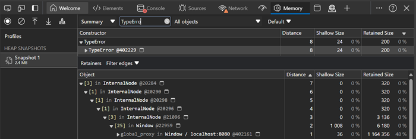

# TypeError Memory Leak Playground

This project demonstrates a memory leak that can occur due to [a Chromium bug 343754408](https://issues.chromium.org/issues/343754408). To observe the problem, click on one of the buttons below, take a heap snapshot, and look for "TypeError" objects. For the repro case, you'll see something that looks like this:

.

For more details [see it running live](https://astegmaier.github.io/playground-type-error-leaks/).

## Running Locally

1. Clone this repo by running `git clone https://github.com/astegmaier/playground-type-error-leaks.git`
2. Change into the directory by running `cd playground-type-error-leaks`
3. Ensure [nodejs](https://nodejs.org/en/) is installed.
4. Run `npx http-server` to start a local server. You can also install `http-server` globally by running `npm install -g http-server` and then running `http-server` directly.
5. Open `http://localhost:8080/` in your browser.
